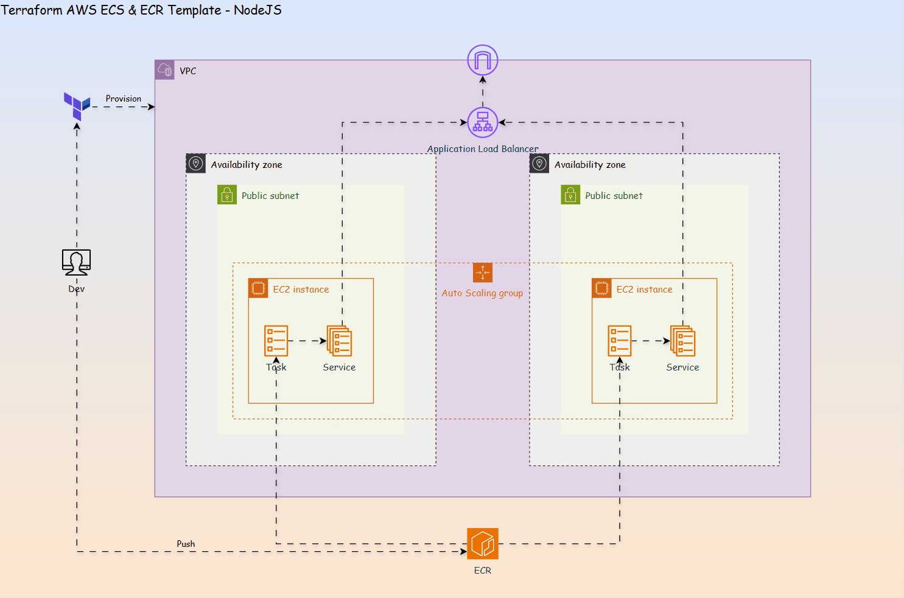
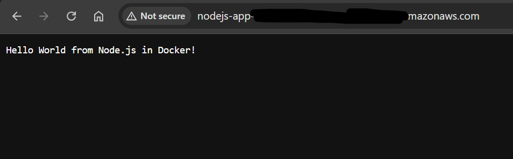

# Terraform AWS ECS & ECR Template - NodeJS

A Terraform template of deploying node.js app using ECS & ECR.

- [Terraform AWS ECS \& ECR Template - NodeJS](#terraform-aws-ecs--ecr-template---nodejs)
  - [Diagram](#diagram)
  - [Steps](#steps)

---

## Diagram



---

## Steps

1. Develop Node.js app locally
2. Create ECR repo

```sh
# init tf
cd terraform
terraform init

# create ECR and get ECR url
terraform apply -target=aws_ecr_repository.ecr_repo
```

---

3. Build and push image to ECR

```sh
# build image with tag
cd ../app
docker build -t ecr_url:1.0 .
# confirm
docker images

# push image

# ecr login
# replace aws_region and aws_account_id
aws ecr get-login-password --region aws_region | docker login --username AWS --password-stdin aws_account_id.dkr.ecr.aws_region.amazonaws.com

# push image to ecr
docker push ecr_repo_url:1.0
# confirm
aws ecr list-images --repository-name ecr_repo
```

---

4. Create infrastractures using ECS

5. Confirm
   - Visiting ALB DNS Url.


